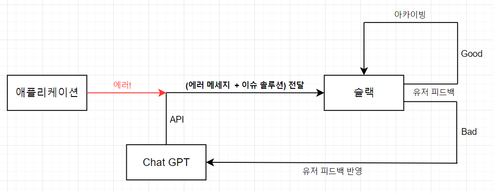

# 2024-oss-team14

## cautry




## Todo

### 2024년 04월 19일 제안서 발표

- [x] <s>Figma UI 제작</s>
- [x] <s>React 페이지 제작</s>
- [x] <s>발표 자료 제작</s>

### 2024년 04월 24일 발표 리뷰

- [x] <s>Express 백엔드 템플릿</s>
- [x] <s>ChatGPT API 연결</s> <em>5.19 완료</em>

```
// 변경 전 4.19
const oldDataSchema = {
  project: "cautry web view",
  tags: ["node.js", "javascript"],
  message: "error message",
  statusCode: 500,
  stack: "...",
  solution: "from chat gpt",
};
```

```javascript
// 변경 후 5.19
const oldNewSchema = {
  id: 1,
  project: "cautry web view",
  tags: ["python", "FastAPI", "Node.js", "Next.js"],
  message: "error message",
  statusCode: 500,
  stack: "fail to reference",
  solution: "from chat gpt",
  isResolved: false,
};
```

> <s>중간고사 04월 26일 금요일</s>
>
> > - Git 기본 명령어와 개념
> > - Git rebase & merge
> > - Git pull requests
> > - LLM & ChatGPT

### 2024년 05월 19일 meet up

- [x] [Demo 1](https://github.com/PiLab-CAU/OpenSourceProject-2401/issues/23)
- [x] [5/19 meet up #6](https://github.com/yongsoocho/2024-oss-team14/issues/6)

### 2024년 05월 24일 데모 발표

- [ ] 발표자료 준비

### 2024년 06월 3일 프로젝트 최종 완성

- [ ] QA
- [x] <s>React 프로젝트 Vercel 배포</s> <em>5.19 vercel -> cloud flare 완료</em>
- [x] <s>Express 프로젝트 EC2 배포</s> <em>5.19 완료</em>
